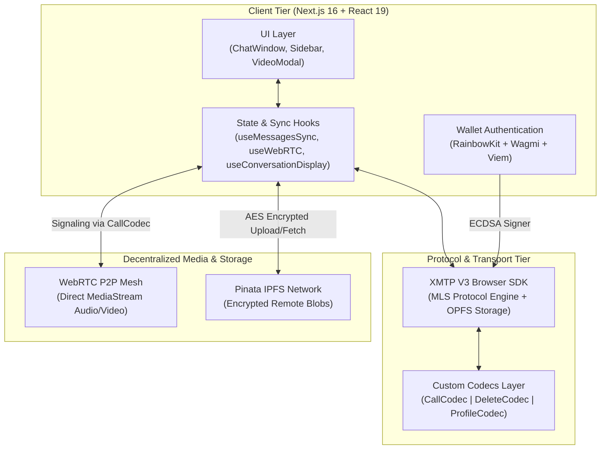
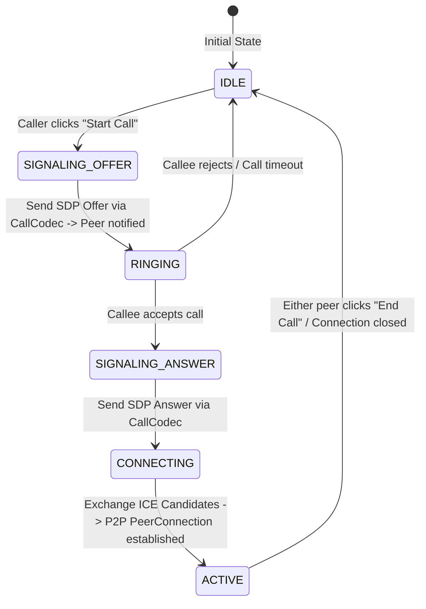

# dChat

<div align="center">

  <picture>
    <source media="(prefers-color-scheme: dark)" srcset="./public/dChat-dark.svg">
    <source media="(prefers-color-scheme: light)" srcset="./public/dChat-light.svg">
    
  </picture>

  <br />
  <br />

  <h3>Sovereign. End-to-End Encrypted. Decentralized Web3 Communications.</h3>

  <p align="center">
    A next-generation decentralized communication suite delivering military-grade <b>MLS encrypted messaging</b>, peer-to-peer <b>WebRTC audio/video calling</b>, and zero-knowledge <b>IPFS file sharing</b> directly between Ethereum wallets.
  </p>

  <p align="center">
    <a href="https://d-chatapp.vercel.app">
      
    </a>
    <a href="./project_overview.md">
      
    </a>
    <a href="./project_explanation.md">
      
    </a>
    <a href="https://github.com/Swadesh-c0de/dChat/issues">
      
    </a>
  </p>

  <p align="center">
    
    
    
    
    
    
    
    
    
  </p>

</div>

---

## 📑 Table of Contents

- [🌟 Executive Summary](#-executive-summary)
- [⚖️ Web2 vs dChat Comparison](#️-web2-vs-dchat-comparison)
- [✨ Key Features](#-key-features)
- [🏛️ System Architecture](#️-system-architecture)
  - [High-Level Architecture](#high-level-architecture)
  - [WebRTC Signaling State Machine](#webrtc-signaling-state-machine)
- [🧩 Custom XMTP Codecs](#-custom-xmtp-codecs)
- [🛠️ Tech Stack & Ecosystem](#️-tech-stack--ecosystem)
- [📁 Project Structure](#-project-structure)
- [⚙️ Environment Configuration](#️-environment-configuration)
- [🔒 Security & Cryptographic Model](#-security--cryptographic-model)
- [🗺️ Product Roadmap](#️-product-roadmap)
- [🤝 Contributing](#-contributing)
- [📜 License & Acknowledgements](#-license--acknowledgements)

---

## 🌟 Executive Summary

Traditional communication platforms rely on centralized servers that harvest personal metadata, risk single-point data breaches, and gatekeep user identities. **dChat** redefines digital communication from the ground up:

- **No Central Server Database**: Identity, conversations, and contact graphs are owned 100% by your cryptographic wallet.
- **Messaging Layer Security (MLS)**: Built on **XMTP V3**, utilizing TreeKEM for scalable, forward-secret, multi-device group and direct messaging.
- **Serverless WebRTC Calling**: Audio and video connections are signaled securely over encrypted XMTP payloads, creating pure peer-to-peer media streams with zero middleman surveillance.
- **Zero-Knowledge Encrypted Attachments**: Client-side AES-256-GCM encryption before pinning to IPFS via Pinata.

---

## ⚖️ Web2 vs dChat Comparison

| Feature / Dimension | Traditional Chat (WhatsApp, Telegram, Discord) | **dChat** (XMTP + WebRTC + IPFS) |
| :--- | :--- | :--- |
| **User Identity** | Phone number / Email / Central Account | **Cryptographic Ethereum Wallet (EOA)** |
| **Authentication** | SMS OTP / Passwords | **EIP-191 ECDSA Signatures** |
| **Encryption Standard** | Server-side / 1-to-1 Double Ratchet | **XMTP V3 MLS (Messaging Layer Security)** |
| **Calling Metadata** | Logged by central SIP / TURN / WebRTC servers | **E2E Encrypted Signaling via XMTP Codecs** |
| **Attachment Storage** | Unencrypted / Proprietary Cloud Buckets | **Client-Side AES-256-GCM + Pinata IPFS** |
| **Message Revocation** | Soft delete in central database | **Cryptographic `DeleteCodec` Network Broadcast** |
| **Censorship Resistance** | Low (Accounts can be banned/frozen) | **Absolute (Decentralized node gossip network)** |

---

## ✨ Key Features

```
  ┌─────────────────┐      ┌──────────────────┐      ┌──────────────────┐
  │   💬 XMTP V3    │      │    📞 WebRTC     │      │   📦 IPFS + AES  │
  │  MLS Messaging  │      │  P2P Audio/Video │      │  Encrypted Files │
  └─────────────────┘      └──────────────────┘      └──────────────────┘
```

### 🔐 1. Wallet-to-Wallet Direct Messaging
- Instant, serverless communication between any EVM-compatible addresses.
- Multi-device inbox synchronization backed by the browser's **Origin Private File System (OPFS)**.
- Real-time reactive message streams across all active chats.

### 📞 2. High-Definition Peer-to-Peer Voice & Video
- Direct media streaming powered by **WebRTC**.
- Completely decentralized signaling pipeline using XMTP's `CallCodec` (SDP Offers, Answers, and ICE Candidates exchanged over encrypted transport).
- In-call controls: Dynamic mic mute, camera toggle, call timer, and graceful disconnect handlers.

### 🛡️ 3. Advanced Messaging Layer Security (MLS)
- Logarithmic $O(\log N)$ key updates via **TreeKEM** protocol.
- Forward Secrecy & Post-Compromise Security across multiple devices and installations.
- Automated installation session management to prevent client lockouts.

### 📁 4. Zero-Knowledge Remote Attachments (IPFS)
- Files (Images, PDFs, Documents) are encrypted locally using **AES-256-GCM** before leaving your device.
- Uploaded to **Pinata IPFS**; only the encrypted CID, secret decryption key, and SHA-256 integrity hash are transmitted to the recipient.
- In-memory client decryption ensuring zero plaintext data hits third-party gateways.

### 👤 5. Decentralized Sovereign Profile System
- Set your customized display name and avatar without any centralized user database.
- Profiles are synced across conversations using custom `ProfileCodec` broadcasts and global message listeners.

### 🗑️ 6. Universal Message Revocation ("Delete for Everyone")
- Revoke mistakenly sent messages using the custom `DeleteCodec`.
- Revocation events propagate across peer clients to automatically purge content from active conversation views.

### 😄 7. Rich Expressive Messaging
- Integrated, high-performance emoji picker (`emoji-picker-react`).
- Optimistic UI updates for ultra-responsive sending feel.
- Formatted timestamps, unread indicators, and auto-scroll handling.

### 🌘 8. Cinematic Glassmorphic Aesthetic
- OLED-ready dark mode palette with custom SVG fractal noise filter (`#noise`) preventing color banding.
- GPU-accelerated micro-animations powered by **Framer Motion** and **GSAP**.
- Fully responsive layout engineered for Desktop, Tablet, and Mobile viewport sizes.

---

## 🏛️ System Architecture

### High-Level Architecture



---

### WebRTC Signaling State Machine

Because dChat operates without centralized WebSocket signaling servers, peer negotiation happens asynchronously via encrypted XMTP payloads:



---

## 🧩 Custom XMTP Codecs

dChat extends the core XMTP specification using custom `ContentTypeId` codecs to enable rich protocol extensions:

| Codec | Content Type ID | Payload Structure | Functionality |
| :--- | :--- | :--- | :--- |
| **`CallCodec`** | `xmtp.org/call:1.0` | `{ type, sdp?, candidate?, callType? }` | Decentralized WebRTC signaling (Offer, Answer, ICE Candidates, Call End). |
| **`DeleteCodec`** | `xmtp.org/delete:1.0` | `{ messageId }` | Universal message deletion and remote revocation across peer clients. |
| **`ProfileCodec`** | `xmtp.org/profile:1.0` | `{ name?, avatar? }` | Peer identity sync (display names and avatar URLs) broadcasted over conversations. |
| **`RemoteAttachmentCodec`** | `xmtp.org/remoteAttachment:1.0` | `{ url, secret, contentDigest, ... }` | Zero-knowledge encrypted file transmission via IPFS gateways. |

---

## 🛠️ Tech Stack & Ecosystem

### Core Frontend
- **Framework**: [Next.js 16.2.4](https://nextjs.org/) (App Router, Webpack bundling for WASM)
- **Library**: [React 19.2.5](https://react.dev/)
- **Language**: [TypeScript 5](https://www.typescriptlang.org/) (Strict type-safety)
- **Styling**: [Tailwind CSS 4.0](https://tailwindcss.com/) + PostCSS
- **Animations**: [Framer Motion 12](https://www.framer.com/motion/) & [GSAP 3](https://greensock.com/gsap/)
- **Component Primitives**: [Radix UI](https://www.radix-ui.com/) & [Lucide Icons](https://lucide.dev/)

### Web3 & Cryptography
- **Decentralized Messaging**: [@xmtp/browser-sdk v7](https://xmtp.org/) (MLS Protocol)
- **Encrypted Storage**: [@xmtp/content-type-remote-attachment](https://www.npmjs.com/package/@xmtp/content-type-remote-attachment)
- **Ethereum Interaction**: [Wagmi 2](https://wagmi.sh/) & [Viem 2](https://viem.sh/)
- **Wallet Connection**: [RainbowKit 2.2](https://www.rainbowkit.com/)
- **Decentralized IPFS Storage**: [Pinata SDK v2](https://pinata.cloud/)
- **Async State Management**: [TanStack React Query 5](https://tanstack.com/query/latest)

---

## 📁 Project Structure

```bash
dchat/
├── public/                     # Static assets & branding logos
│   ├── dChat-dark.svg          # Dark mode vector logo
│   └── dChat-light.svg         # Light mode vector logo
├── src/
│   ├── app/                    # Next.js App Router
│   │   ├── api/                # API routes
│   │   ├── chat/               # Main dChat application interface
│   │   ├── globals.css         # Tailwind tokens & custom noise filter
│   │   ├── layout.tsx          # Root layout & providers wrapper
│   │   └── page.tsx            # Cinematic hero landing page
│   ├── components/
│   │   ├── auth/               # Wallet connect & authentication components
│   │   ├── chat/               # Core chat system components
│   │   │   ├── ChatLayout.tsx          # Responsive multi-column layout
│   │   │   ├── ChatSidebar.tsx         # Conversation list & global sync
│   │   │   ├── ChatWindow.tsx          # Active chat window & message stream
│   │   │   ├── ConversationListItem.tsx# Single conversation row
│   │   │   ├── IncomingCallModal.tsx   # Incoming call notification dialog
│   │   │   ├── MessageBubble.tsx       # E2E message bubble & attachment decoder
│   │   │   ├── MessageInput.tsx        # Chat input & emoji selector
│   │   │   ├── NewChatModal.tsx        # Start conversation modal
│   │   │   ├── ProfileModal.tsx        # Identity & avatar customization
│   │   │   └── VideoCallModal.tsx      # WebRTC P2P audio/video interface
│   │   ├── home/               # Landing page feature cards & previews
│   │   ├── layout/             # Global navigation bar & headers
│   │   ├── ui/                 # Accessible Radix UI primitives
│   │   ├── providers.tsx       # React Query & Wagmi context providers
│   │   └── providers-inner.tsx # RainbowKit & Theme initialization
│   ├── hooks/
│   │   ├── useConversationDisplay.ts  # Identity & ENS resolution hook
│   │   ├── useMessagesSync.ts         # Message fetching, streaming & deduping
│   │   ├── useWebRTC.ts               # WebRTC P2P signaling & stream orchestration
│   │   └── use-toast.tsx              # Toast notification triggers
│   ├── lib/
│   │   ├── ipfs.ts             # Pinata IPFS upload client
│   │   ├── logger.ts           # Development environment logger
│   │   ├── utils.ts            # ClassName merge utilities (clsx/tailwind-merge)
│   │   └── xmtp/               # XMTP V3 protocol integration
│   │       ├── codecs/         # Custom codecs (Call, Delete, Profile)
│   │       ├── client.ts       # Singleton client manager & installation handler
│   │       ├── conversations.ts# Conversation creation & management
│   │       └── messages.ts     # Content-type encoders & sender functions
│   └── types/                  # Global TypeScript interfaces & types
├── .env.local                  # Local environment configuration
├── next.config.ts              # Webpack & WASM build rules
├── package.json                # Dependencies & run scripts
└── tsconfig.json               # TypeScript compiler options
```

---

## ⚙️ Environment Configuration

| Variable | Description | Required | Default / Allowed Values |
| :--- | :--- | :---: | :--- |
| `NEXT_PUBLIC_XMTP_ENV` | Specifies the XMTP network environment. Use `dev` for testing with testnet wallets. | **Yes** | `dev` \| `production` \| `local` |
| `NEXT_PUBLIC_WALLET_CONNECT_PROJECT_ID` | Project identifier obtained from WalletConnect Cloud for RainbowKit modal. | **Yes** | 32-character hex ID |
| `NEXT_PUBLIC_PINATA_JWT` | Pinata API JSON Web Token with file pinning permissions for encrypted attachments. | **Yes** | Scoped Pinata JWT |

---

## 🔒 Security & Cryptographic Model

### 1. Messaging Layer Security (MLS) vs Legacy Double Ratchet
dChat runs on **XMTP V3**, replacing pairwise Double Ratchet sessions with IETF-standardized **MLS (RFC 9420)**:
- **Asynchronous Key Updates**: Devices can update cryptographic keys independently without all peers being online.
- **Forward Secrecy (FS)**: Past messages cannot be decrypted even if current device keys are compromised.
- **Post-Compromise Security (PCS)**: Compromised keys automatically self-heal upon the next ratchet iteration.

### 2. Zero-Knowledge Attachment Security
Files are encrypted entirely on the client before being sent across the network:
```text
[Plain File] ──► AES-256-GCM Encrypt ──► [Ciphertext Blob] ──► Upload to Pinata IPFS (CID)
                                                      │
                       [CID + Secret + Hash] ◄────────┘
                                 │
                   (Sent over XMTP MLS Channel)
                                 ▼
[Recipient] ◄── Fetch Ciphertext via CID ──► Verify SHA-256 Digest ──► AES Decrypt with Secret
```

### 3. Secure Context & Storage Constraints
- XMTP V3 requires browser execution inside a **Secure Context (`https://` or `localhost`)**.
- Uses the **Origin Private File System (OPFS)** for local encrypted database caching.
- Built-in session manager automatically revokes stale installations when approaching the 10-installation network cap.

---

## 🗺️ Product Roadmap

- [x] **XMTP V3 MLS Messaging Core** (Wallet-to-Wallet Direct Messaging)
- [x] **Peer-to-Peer WebRTC Calling** (Encrypted signaling over custom codecs)
- [x] **Zero-Knowledge File Sharing** (Client-side AES + Pinata IPFS)
- [x] **Decentralized Profile Broadcasting** (`ProfileCodec`)
- [x] **Message Revocation / Delete for Everyone** (`DeleteCodec`)
- [x] **Cinematic Glassmorphism UI & Noise Shaders**
- [ ] **Multi-Party MLS Group Chats** (Decentralized group messaging)
- [ ] **ENS (Ethereum Name Service) Reverse Resolution** (Display `.eth` domains & ENS avatars)
- [ ] **Decentralized Push Notifications** (XMTP Notification Server integration)
- [ ] **Multi-Peer WebRTC Mesh / SFU Calling** (Group audio/video conferences)
- [ ] **Cross-Chain Wallet Support** (Solana & Cosmos identity bridges)

---

## 🤝 Contributing

Contributions make the open-source community an incredible place to learn, inspire, and create. Any contributions you make are **greatly appreciated**.

1. **Fork the Project**
2. **Create your Feature Branch** (`git checkout -b feature/AmazingFeature`)
3. **Commit your Changes** (`git commit -m 'feat: Add some AmazingFeature'`)
4. **Push to the Branch** (`git push origin feature/AmazingFeature`)
5. **Open a Pull Request**

---

## 📜 License & Acknowledgements

Distributed under the **MIT License**. See [`LICENSE`](./LICENSE) for full details.

### Special Thanks & Acknowledgements
- [XMTP Labs](https://xmtp.org/) — For building the premier communication protocol for Web3.
- [RainbowKit](https://www.rainbowkit.com/) & [Wagmi](https://wagmi.sh/) — For the best-in-class Ethereum wallet connection experience.
- [Pinata](https://pinata.cloud/) — For blazing fast IPFS storage infrastructure.
- [WebRTC](https://webrtc.org/) — For open real-time peer communication capabilities.

---

<div align="center">
  <p>Crafted with precision for the <b>Decentralized Web</b>.</p>
  <p>
    <a href="https://github.com/Swadesh-c0de/dChat">⭐ Star us on GitHub</a> | <a href="https://d-chatapp.vercel.app">🚀 Launch dChat</a>
  </p>
</div>
