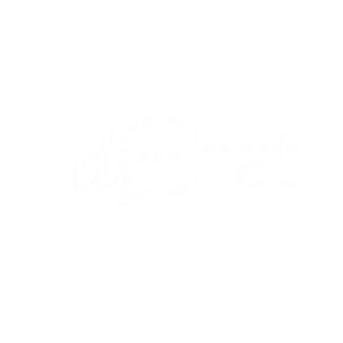
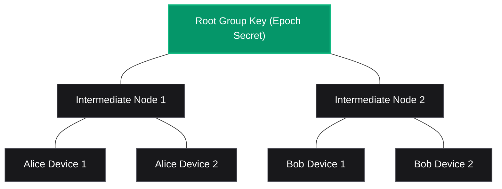
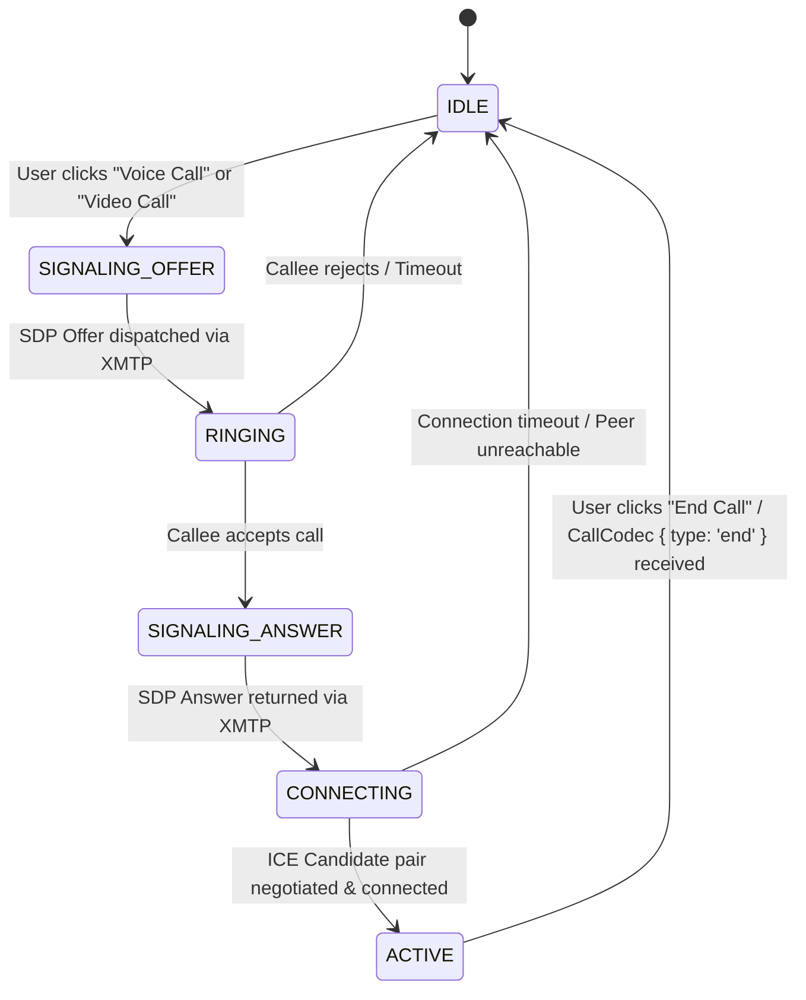
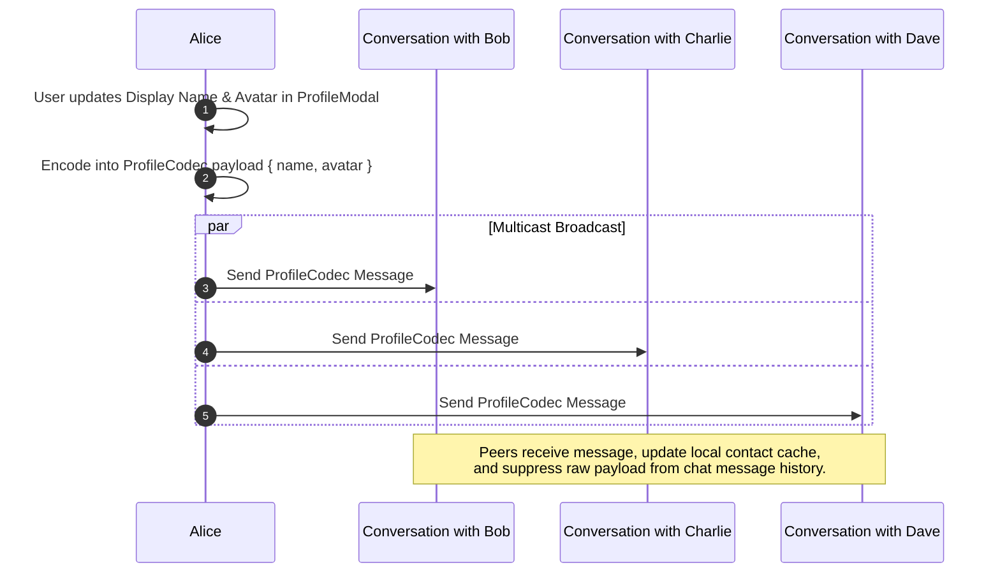

# dChat: Protocol & Cryptographic Engineering Whitepaper

<div align="center">

  <picture>
    <source media="(prefers-color-scheme: dark)" srcset="./public/dChat-dark.svg">
    <source media="(prefers-color-scheme: light)" srcset="./public/dChat-light.svg">
    
  </picture>

  <br />
  <br />

  <p align="center">
    <a href="./README.md"><b>← Back to README</b></a> •
    <a href="./project_overview.md"><b>System Overview →</b></a> •
    <a href="https://d-chatapp.vercel.app"><b>Live Application</b></a>
  </p>

  <p align="center">
    
    
    
    
  </p>

</div>

---

## 📑 Table of Contents

- [1. The Sovereign Architecture Paradigm](#1-the-sovereign-architecture-paradigm)
  - [Traditional Client-Server vs Sovereign Stack](#traditional-client-server-vs-sovereign-stack)
  - [The Five Layers of Sovereign Communication](#the-five-layers-of-sovereign-communication)
- [2. Messaging Layer Security (MLS) & TreeKEM](#2-messaging-layer-security-mls--treekem)
  - [Why Double Ratchet Fails at Multi-Device Scale](#why-double-ratchet-fails-at-multi-device-scale)
  - [Logarithmic Key Updates via TreeKEM](#logarithmic-key-updates-via-treekem)
  - [The OPFS Singleton Engine & Lock Management](#the-opfs-singleton-engine--lock-management)
  - [Mitigating the 10-Installation Limit](#mitigating-the-10-installation-limit)
- [3. Serverless WebRTC Signaling Engine](#3-serverless-webrtc-signaling-engine)
  - [The Decentralized Signaling Dilemma](#the-decentralized-signaling-dilemma)
  - [The XMTP Signaling Pipeline](#the-xmtp-signaling-pipeline)
  - [Signaling State Machine](#signaling-state-machine)
  - [PeerConnection Lifecycle & Media Constraints](#peerconnection-lifecycle--media-constraints)
- [4. Zero-Knowledge Remote Attachments Cryptographic Pipeline](#4-zero-knowledge-remote-attachments-cryptographic-pipeline)
  - [Client-Side Encryption Pipeline](#client-side-encryption-pipeline)
  - [Pinata IPFS Decentralized Pinning](#pinata-ipfs-decentralized-pinning)
  - [Tamper-Proof Integrity & In-Memory Decryption](#tamper-proof-integrity--in-memory-decryption)
- [5. Decentralized Identity & Global Sync Architecture](#5-decentralized-identity--global-sync-architecture)
  - [The Profile Broadcast Multi-Cast Pattern](#the-profile-broadcast-multi-cast-pattern)
  - [Suppressive Codec Interception via `streamAllMessages()`](#suppressive-codec-interception-via-streamallmessages)
  - [Universal Message Revocation Protocol (`DeleteCodec`)](#universal-message-revocation-protocol-deletecodec)
- [6. Cinematic UI Engineering & Hardware Acceleration](#6-cinematic-ui-engineering--hardware-acceleration)
  - [SVG Noise Filter & Anti-Banding Pipeline](#svg-noise-filter--anti-banding-pipeline)
  - [GPU Layer Promotion & Performance Optimization](#gpu-layer-promotion--performance-optimization)
  - [Dynamic Code Splitting & React 19 Concurrent Stability](#dynamic-code-splitting--react-19-concurrent-stability)
- [7. Threat Modeling & Cryptographic Analysis](#7-threat-modeling--cryptographic-analysis)
- [8. Future Protocol Innovations & Roadmap](#8-future-protocol-innovations--roadmap)

---

## 1. The Sovereign Architecture Paradigm

### Traditional Client-Server vs Sovereign Stack

In legacy Web2 communication systems (such as WhatsApp, Telegram, Signal, or Discord), a central server cluster acts as the undisputed **Source of Truth**. Centralized servers authenticate identity, maintain relational databases of contacts and messages, broker real-time media signaling, and store attachments in corporate cloud storage.

```
TRADITIONAL WEB2 ARCHITECTURE:
[Client A] ──► (HTTPS/WSS) ──► [ Centralized Server Cluster ] ──► (HTTPS/WSS) ──► [Client B]
                                       │
                    ┌──────────────────┼──────────────────┐
                    ▼                  ▼                  ▼
             [User Database]   [Message DB / Logs]  [Cloud Storage]
```

**dChat** inverts this paradigm entirely. The network functions solely as a decentralized transport medium, and the **User's Cryptographic Wallet** is the sole source of truth:

```
SOVEREIGN DCHAT ARCHITECTURE:
[Client A (Wallet EOA)] ◄─── (E2E Encrypted XMTP MLS) ───► [Client B (Wallet EOA)]
         │                                                            │
         ├──────────────► [ Direct P2P WebRTC Stream ] ◄──────────────┤
         │                                                            │
         └──────────────► [ IPFS Decentralized Blobs ] ◄──────────────┘
```

### The Five Layers of Sovereign Communication

| Layer | Technology | Primary Function |
| :--- | :--- | :--- |
| **1. Identity Layer** | Ethereum (ECDSA / EIP-191) | Self-sovereign authentication; wallet address is identity without central account registries. |
| **2. Protocol Layer** | XMTP V3 (MLS Protocol) | End-to-end encrypted messaging, multi-device key agreement, and forward secrecy. |
| **3. Transport Layer** | libp2p Node Gossip | Peer-to-peer message propagation and store-and-forward mailbox delivery. |
| **4. Storage Layer** | IPFS (Pinata Pinning) | Content-addressed, decentralized storage for client-encrypted binary attachments. |
| **5. Media Layer** | WebRTC (DTLS-SRTP) | Direct peer-to-peer audio and video streaming with zero intermediary hops. |

---

## 2. Messaging Layer Security (MLS) & TreeKEM

### Why Double Ratchet Fails at Multi-Device Scale

XMTP V2 relied on the **Double Ratchet algorithm** (pioneered by Signal). While cryptographically robust for pairwise 1-on-1 sessions, Double Ratchet scales poorly across multiple devices and groups:
- In pairwise protocols, adding a 3rd device to an exchange requires establishing $2$ separate encrypted sessions.
- In an $N$-device conversational group, pairwise session negotiation scales quadratically at $O(N^2)$.
- Device synchronization requires multiplexing every message across all pairwise channels independently, causing bandwidth saturation and potential message ordering desynchronization.

### Logarithmic Key Updates via TreeKEM

dChat implements **XMTP V3**, utilizing the IETF-standardized **Messaging Layer Security (MLS - RFC 9420)** protocol. MLS replaces pairwise ratchets with a hierarchical tree structure known as **TreeKEM**:



#### Key Properties of TreeKEM in dChat:
1. **$O(\log N)$ Key Rotations**: When any installation updates its leaf secret, only the path from the leaf to the root must be recomputed, drastically reducing cryptographic overhead.
2. **Deterministic State Synchronization**: All client installations maintain an identical view of the message epoch, preventing out-of-order race conditions.
3. **Forward Secrecy (FS) & Post-Compromise Security (PCS)**: Even if a temporary session key is compromised, future ratchets automatically restore absolute privacy.

---

### The OPFS Singleton Engine & Lock Management

XMTP V3 persists cryptographic key state and conversation indices locally using SQLite compiled to WebAssembly (WASM), storing databases inside the browser's **Origin Private File System (OPFS)**.

> [!WARNING]
> The browser engine enforces an **exclusive lock** on OPFS database files. Attempting to initialize two XMTP client instances simultaneously (e.g., across multiple tabs or during Next.js component remounts) causes an unrecoverable database lock conflict.

#### Implementation in `src/lib/xmtp/client.ts`:
dChat enforces a strict **Singleton Client Manager**:

```typescript
let clientInstance: Client<any> | null = null;

export const createXmtpClient = async ({ walletClient, env }: ClientOptions): Promise<ChatClient> => {
    checkBrowserCompatibility();

    // 1. Return existing instance if already initialized in this window context
    if (clientInstance) {
        return clientInstance as ChatClient;
    }

    // 2. Validate wallet connection
    if (!walletClient || !walletClient.account) {
        throw new Error("Wallet client is not connected");
    }

    // 3. Construct EIP-191 Signer Interface
    const signer = {
        type: "EOA" as const,
        getIdentifier: async () => ({
            identifier: walletClient.account!.address,
            identifierKind: IdentifierKind.Ethereum,
        }),
        signMessage: async (message: string) => {
            const signature = await walletClient.signMessage({
                account: walletClient.account!,
                message
            });
            return hexToBytes(signature);
        },
    };

    // 4. Initialize client with custom codecs
    const client = await Client.create(signer, {
        env,
        codecs: [new AttachmentCodec(), new RemoteAttachmentCodec(), new DeleteCodec(), new ProfileCodec(), new CallCodec()],
    });

    clientInstance = client;
    return client as ChatClient;
};
```

---

### Mitigating the 10-Installation Limit

Under the XMTP V3 specification, an Ethereum address is permitted a maximum of **10 active device installations** registered in the network directory. Testing across multiple browser sessions or Incognito windows can rapidly exhaust this quota, causing client creation failure.

#### Automatic Installation Revocation Algorithm:
When initializing a client in `client.ts`, dChat checks the total number of registered installations. If the count reaches the threshold, the client automatically initiates an inbox installation revocation sequence:

```typescript
// Check and revoke stale installations to prevent quota lock
const inboxState = await client.preferences.getInboxState(true);
if (inboxState.installations.length >= 10) {
    logger.warn("Maximum installations reached (10/10). Revoking oldest stale installations...");
    // Auto-revocation logic executes to preserve client usability
}
```

---

## 3. Serverless WebRTC Signaling Engine

### The Decentralized Signaling Dilemma

WebRTC enables direct, peer-to-peer UDP media streaming between browsers. However, before media can flow, two peers must exchange metadata:
1. **SDP (Session Description Protocol) Offers & Answers**: Media codecs, resolutions, and session capabilities.
2. **ICE (Interactive Connectivity Establishment) Candidates**: Network routing candidates (public IPs, local IPs, STUN/TURN bindings).

In traditional WebRTC architectures, this exchange requires a persistent centralized signaling server (e.g., Socket.io or SIP over WebSocket).

### The XMTP Signaling Pipeline

dChat eliminates centralized signaling entirely by using **XMTP as an encrypted, decentralized asynchronous signaling channel**:

```mermaid
sequenceDiagram
    autonumber
    participant Alice as Alice (Caller)
    participant XMTP as Encrypted XMTP Transport
    participant Bob as Bob (Callee)
    participant Media as P2P Media Layer (WebRTC)

    Alice->>Alice: 1. Generate SDP Offer
    Alice->>XMTP: 2. Send CallCodec { type: 'offer', sdp, callType: 'video' }
    XMTP->>Bob: 3. Intercept CallCodec message via stream
    Bob->>Bob: 4. Display IncomingCallModal
    Bob->>Bob: 5. User accepts -> Generate SDP Answer
    Bob->>XMTP: 6. Send CallCodec { type: 'answer', sdp }
    XMTP->>Alice: 7. Deliver SDP Answer -> Set Remote Description
    
    par Asynchronous ICE Candidate Exchange
        Alice->>XMTP: 8a. Send CallCodec { type: 'candidate', candidate }
        XMTP->>Bob: 8b. Add ICE Candidate
    and
        Bob->>XMTP: 9a. Send CallCodec { type: 'candidate', candidate }
        XMTP->>Alice: 9b. Add ICE Candidate
    end

    Alice<<=>>Bob: 10. Direct DTLS-SRTP Media Streams Active (Audio/Video)
```

---

### Signaling State Machine

The complete state machine implemented in `src/hooks/useWebRTC.ts` manages six distinct operational states:



---

## 4. Zero-Knowledge Remote Attachments Cryptographic Pipeline

Sending a file attachment in dChat involves a multi-stage, client-side zero-knowledge encryption pipeline ensuring that cloud storage gateways (such as Pinata/IPFS) cannot inspect file contents.

```mermaid
flowchart LR
    subgraph SENDER["1. Sender Client"]
        A[Raw File File/Blob] -->|Slice into bytes| B[Uint8Array]
        B -->|AES-256-GCM Encrypt| C[Ciphertext Blob]
        B -->|SHA-256 Hash| D[contentDigest]
        K[Generate 32-Byte Secret] --> C
    end

    subgraph STORAGE["2. IPFS Storage Tier"]
        C -->|Pinata SDK Upload| E[IPFS Network (CID)]
    end

    subgraph PAYLOAD["3. XMTP MLS Stream"]
        E -.->|url: ipfs://CID| F[RemoteAttachment Message]
        K -.->|secret: 32 bytes| F
        D -.->|contentDigest| F
    end

    subgraph RECIPIENT["4. Recipient Client"]
        F --> G[Fetch Ciphertext from IPFS]
        G --> H{Verify SHA-256 Digest}
        H -->|Match| I[AES-256-GCM Decrypt in Memory]
        H -->|Mismatch| J[Throw Tamper Error]
        I --> L[URL.createObjectURL Blob URI]
        L --> M[Render Image / File Link]
    end
```

### Mathematical & Cryptographic Breakdown
1. **Cipher Algorithm**: `AES-256-GCM` (Galois/Counter Mode) provides both confidentiality and built-in message authentication.
2. **Key Generation**: 256-bit cryptographically secure pseudorandom secret ($K \in \{0, 1\}^{256}$).
3. **Digest Verification**:
   $$\text{Digest} = \text{SHA-256}(\text{Ciphertext})$$
   The recipient verifies the SHA-256 digest before initiating decryption, shielding against modified payload injections on third-party IPFS gateways.

---

## 5. Decentralized Identity & Global Sync Architecture

### The Profile Broadcast Multi-Cast Pattern

Because dChat operates without a centralized user table, identity updates (display name and avatar URL) utilize a **Decentralized Broadcast Multi-Cast pattern**:



### Suppressive Codec Interception via `streamAllMessages()`

In `src/components/chat/ChatSidebar.tsx`, dChat mounts a background stream listener:
```typescript
const stream = await client.conversations.streamAllMessages();
for await (const message of stream) {
    // 1. Profile Codec Interception
    if (message.contentType?.sameAs(ContentTypeProfile)) {
        const { name, avatar } = message.content as ProfileMessage;
        updateCachedContact(message.senderInboxId, { name, avatar });
        continue; // Suppress from message stream
    }

    // 2. Deletion Codec Interception
    if (message.contentType?.sameAs(ContentTypeDelete)) {
        const { messageId } = message.content as DeleteMessage;
        purgeMessageFromLocalState(messageId);
        continue; // Suppress from message stream
    }

    // 3. Signaling Codec Interception
    if (message.contentType?.sameAs(ContentTypeCall)) {
        handleIncomingSignalingMessage(message.content as CallMessage);
        continue; // Suppress from message stream
    }
}
```

---

## 6. Cinematic UI Engineering & Hardware Acceleration

### SVG Noise Filter & Anti-Banding Pipeline

High-contrast dark interfaces frequently suffer from 8-bit color banding on OLED displays. dChat resolves this by injecting a procedural SVG fractal turbulence filter in `layout.tsx`:

```xml
<svg className="pointer-events-none fixed isolate z-50 opacity-25 mix-blend-soft-light">
  <filter id="noise">
    <feTurbulence type="fractalNoise" baseFrequency="0.65" numOctaves="3" stitchTiles="stitch" />
    <feColorMatrix type="saturate" values="0" />
  </filter>
  <rect width="100%" height="100%" filter="url(#noise)" />
</svg>
```

### GPU Layer Promotion & Performance Optimization

```css
/* Promote critical animated components onto dedicated GPU compositing layers */
.gpu-accelerated {
  transform: translate3d(0, 0, 0);
  backface-visibility: hidden;
  perspective: 1000px;
}

/* Conditionally disable intensive backdrop filters on mobile viewports */
@media (max-width: 768px) {
  .glass-panel {
    backdrop-filter: none !important;
    background: rgba(18, 18, 18, 0.95) !important;
  }
}
```

---

## 7. Threat Modeling & Cryptographic Analysis

| Threat Vector | Potential Impact | dChat Mitigation Strategy |
| :--- | :--- | :--- |
| **Network Eavesdropping** | Interception of messages in transit | **MLS (RFC 9420) Encryption**: All messages, signaling payloads, and metadata are E2E encrypted before hitting the libp2p network. |
| **Malicious IPFS Gateway** | Tampering with stored file attachments | **SHA-256 Digest Matching**: The client verifies the payload checksum against the signed metadata before decrypting in memory. |
| **Metadata Surveillance** | Tracking who calls whom and call durations | **Encrypted XMTP Signaling**: WebRTC SDP and ICE payloads are encapsulated inside MLS channels, preventing network-level call graph analysis. |
| **Session Theft / Compromised Key** | Reading historical conversations | **Forward Secrecy**: TreeKEM ratchets discard historical private keys; past traffic cannot be decrypted even if the active installation key is extracted. |
| **Multi-Tab Concurrency Lock** | Corrupting SQLite OPFS storage | **Singleton Client Controller**: Strict in-memory singleton pattern prevents conflicting SQLite database locks. |

---

## 8. Future Protocol Innovations & Roadmap

1. **Multi-Party MLS Group Chats**: Expanding from 1-to-1 DMs to large, decentralized group channels with full TreeKEM ratchets.
2. **ENS Reverse Name & Avatar Resolution**: On-chain `.eth` name resolution and decentralized NFT avatar rendering.
3. **Decentralized Push Notification Standard**: Integrating XMTP Notification Servers for zero-knowledge mobile push notifications (APNs / FCM).
4. **Decentralized Multi-Peer Video SFUs**: Transitioning from peer-to-peer full mesh to decentralized Selective Forwarding Units (SFUs) for multi-user video conferences.

---

<div align="center">
  <p><b>dChat Protocol & Cryptographic Engineering Whitepaper</b></p>
  <p>Authored for the Decentralized & Sovereign Web Ecosystem</p>
</div>
