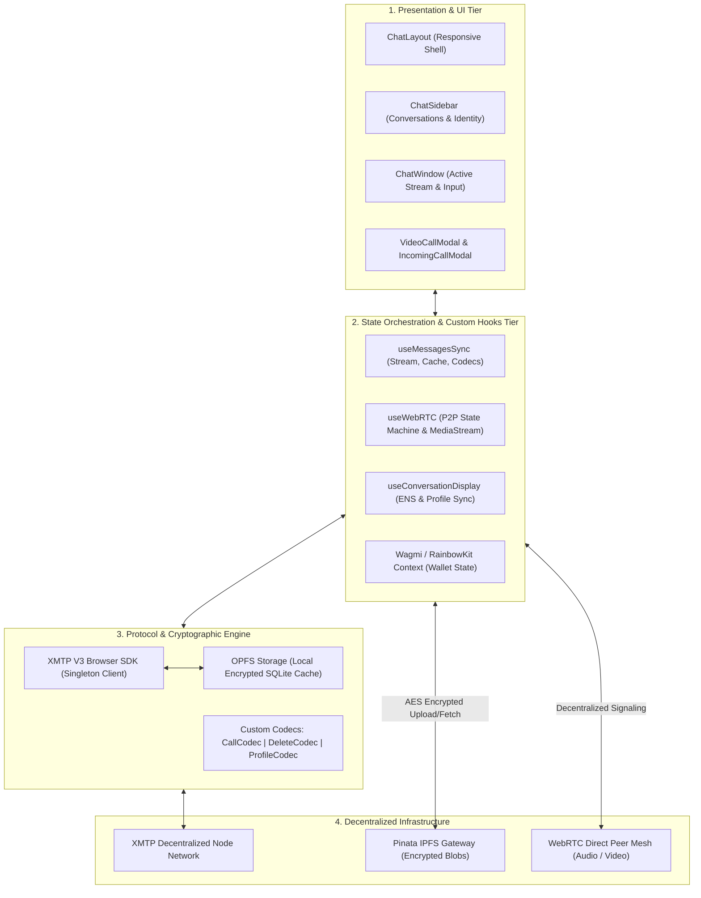
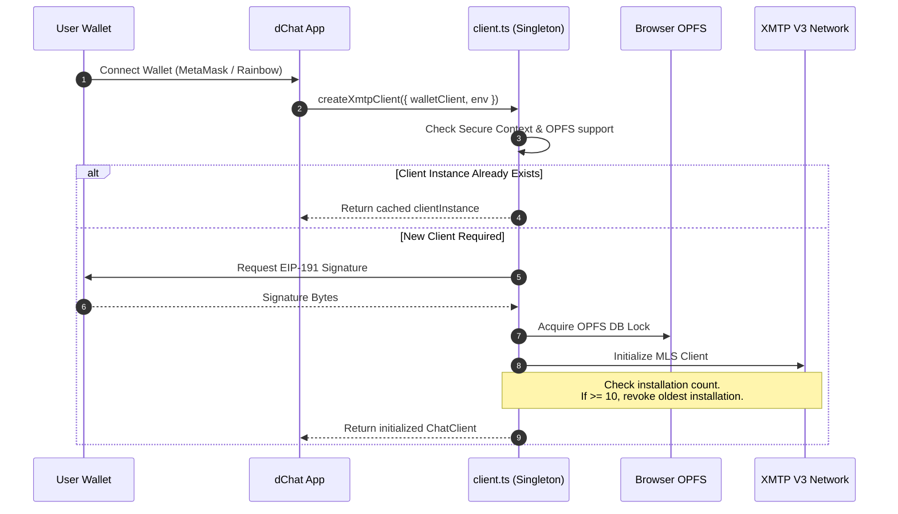
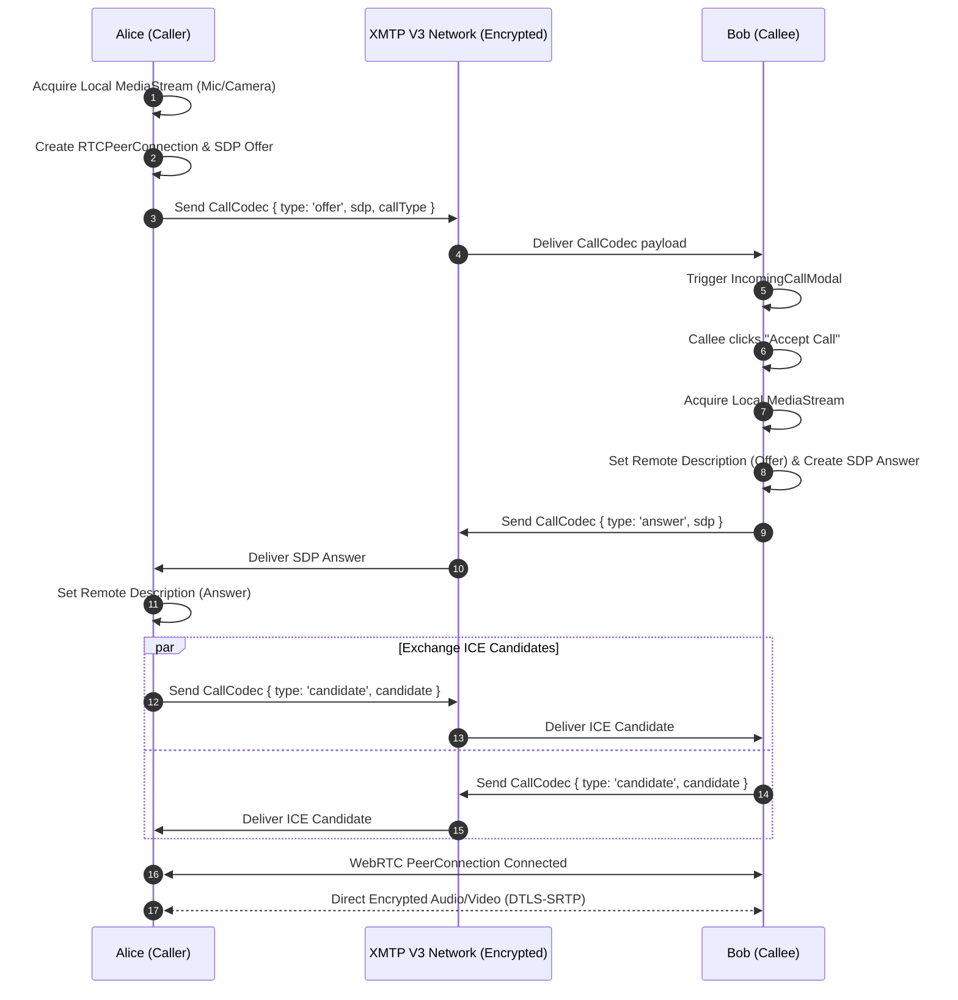

# dChat: System Architecture & Technical Overview

<div align="center">

  <picture>
    <source media="(prefers-color-scheme: dark)" srcset="./public/dChat-dark.svg">
    <source media="(prefers-color-scheme: light)" srcset="./public/dChat-light.svg">
    
  </picture>

  <br />
  <br />

  <p align="center">
    <a href="./README.md"><b>← Back to README</b></a> •
    <a href="./project_explanation.md"><b>Technical Whitepaper →</b></a> •
    <a href="https://d-chatapp.vercel.app"><b>Live Application</b></a>
  </p>

  <p align="center">
    
    
    
    
  </p>

</div>

---

## 📑 Table of Contents

- [1. Executive Summary & Design Philosophy](#1-executive-summary--design-philosophy)
- [2. High-Level Architecture](#2-high-level-architecture)
- [3. Component Hierarchy & Module Breakdown](#3-component-hierarchy--module-breakdown)
  - [App Router Layer (`src/app/`)](#app-router-layer-srcapp)
  - [Chat Component Subsystem (`src/components/chat/`)](#chat-component-subsystem-srccomponentschat)
  - [Custom Hooks Tier (`src/hooks/`)](#custom-hooks-tier-srchooks)
  - [Protocol & Library Core (`src/lib/`)](#protocol--library-core-srclib)
- [4. State Management & Lifecycle Architecture](#4-state-management--lifecycle-architecture)
  - [Singleton XMTP Client Lifecycle](#singleton-xmtp-client-lifecycle)
  - [Reactive Message Sync & Streaming](#reactive-message-sync--streaming)
- [5. WebRTC Peer-to-Peer Calling Subsystem](#5-webrtc-peer-to-peer-calling-subsystem)
- [6. Zero-Knowledge IPFS Storage Pipeline](#6-zero-knowledge-ipfs-storage-pipeline)
- [7. Custom Protocol Codecs](#7-custom-protocol-codecs)
- [8. UI/UX Design System & Performance Strategy](#8-uiux-design-system--performance-strategy)
- [9. Security & Privacy Guarantees](#9-security--privacy-guarantees)

---

## 1. Executive Summary & Design Philosophy

**dChat** is a sovereign, serverless communication suite built for Ethereum-compatible wallets. It delivers end-to-end encrypted messaging, peer-to-peer audio/video streaming, and zero-knowledge encrypted file sharing without centralized database dependencies or intermediary metadata harvesting.

### Core Architectural Axioms
1. **Wallet-as-Identity (EOA/Smart Account)**: Authentication relies strictly on cryptographic ECDSA/EIP-191 signatures. No passwords, phone numbers, or emails.
2. **Serverless Transport**: Message routing and synchronization are handled by the decentralized **XMTP V3 network** using the **Messaging Layer Security (MLS)** protocol.
3. **Decentralized Signaling**: WebRTC connections negotiate SDP offers, answers, and ICE candidates directly over encrypted XMTP payloads without central signaling servers.
4. **Zero-Knowledge Storage**: Files are encrypted client-side using **AES-256-GCM** before being pinned to **IPFS**, ensuring that only the recipient holds the decryption secret.
5. **Cinematic & Resilient UX**: Designed with OLED-ready dark aesthetics, smooth micro-interactions, and robust local caching via the browser's **Origin Private File System (OPFS)**.

---

## 2. High-Level Architecture

The dChat system is divided into four distinct architectural tiers:



---

## 3. Component Hierarchy & Module Breakdown

### App Router Layer (`src/app/`)
- [`src/app/page.tsx`](file:///home/veronica/Desktop/dchat/src/app/page.tsx): Cinematic landing page featuring dynamic feature cards, live protocol statistics, interactive terminal previews, and wallet connection CTA.
- [`src/app/chat/page.tsx`](file:///home/veronica/Desktop/dchat/src/app/chat/page.tsx): Main authenticated application view hosting the full conversational suite.
- [`src/app/layout.tsx`](file:///home/veronica/Desktop/dchat/src/app/layout.tsx): Root layout with global styling tokens, SVG noise shader filters, and provider wrapping.

### Chat Component Subsystem (`src/components/chat/`)

```
src/components/chat/
├── ChatLayout.tsx          # Master layout managing sidebar toggle and responsive grid
├── ChatSidebar.tsx         # Conversation listing, unread indicators, new chat trigger
├── ChatWindow.tsx          # Active message timeline, call triggers, profile actions
├── ConversationListItem.tsx# Single conversation row with avatar and last message preview
├── MessageBubble.tsx       # Message rendering (Text, Encrypted Attachments, Revocation)
├── MessageInput.tsx        # Message composition, file attachment picker, emoji keyboard
├── NewChatModal.tsx        # Start new DM by entering recipient Ethereum address
├── ProfileModal.tsx        # Edit display name and custom avatar URL
├── VideoCallModal.tsx      # Active audio/video interface with mute, camera & end call
└── IncomingCallModal.tsx   # Incoming call alert dialog with Accept/Reject controls
```

### Custom Hooks Tier (`src/hooks/`)

| Hook | File | Primary Responsibility |
| :--- | :--- | :--- |
| **`useMessagesSync`** | [`useMessagesSync.ts`](file:///home/veronica/Desktop/dchat/src/hooks/useMessagesSync.ts) | Fetches historical messages, deduplicates message streams, handles optimistic UI updates, and intercepts custom codecs (Deletion, Signaling, Attachments). |
| **`useWebRTC`** | [`useWebRTC.ts`](file:///home/veronica/Desktop/dchat/src/hooks/useWebRTC.ts) | Orchestrates the complete WebRTC peer connection lifecycle, manages local/remote `MediaStream` objects, exchanges SDP/ICE candidates via XMTP, and exposes call status. |
| **`useConversationDisplay`** | [`useConversationDisplay.ts`](file:///home/veronica/Desktop/dchat/src/hooks/useConversationDisplay.ts) | Resolves Ethereum addresses into human-readable display names, handles ENS identities, and retrieves cached profiles. |
| **`useToast`** | [`use-toast.tsx`](file:///home/veronica/Desktop/dchat/src/hooks/use-toast.tsx) | Lightweight toast dispatch system for UI feedback (copy alerts, errors, connection status). |

### Protocol & Library Core (`src/lib/`)

- [`src/lib/xmtp/client.ts`](file:///home/veronica/Desktop/dchat/src/lib/xmtp/client.ts): Singleton XMTP V3 client manager with OPFS compatibility checks and automated session revocation to prevent the 10-installation limit error.
- [`src/lib/xmtp/conversations.ts`](file:///home/veronica/Desktop/dchat/src/lib/xmtp/conversations.ts): Handles conversation retrieval, direct message channel creation, and peer address validation.
- [`src/lib/xmtp/messages.ts`](file:///home/veronica/Desktop/dchat/src/lib/xmtp/messages.ts): Message sending utilities for plaintext, remote attachments, deletion tombstones, and profile updates.
- [`src/lib/ipfs.ts`](file:///home/veronica/Desktop/dchat/src/lib/ipfs.ts): Pinata SDK integration for decentralized pinning of client-side encrypted attachment blobs.

---

## 4. State Management & Lifecycle Architecture

### Singleton XMTP Client Lifecycle

Because XMTP V3 uses the browser's **Origin Private File System (OPFS)** for local caching, opening multiple browser tabs could result in SQLite database lock conflicts. dChat solves this via a robust singleton architecture:



### Reactive Message Sync & Streaming

1. **Initial History Fetch**: On conversation selection, `useMessagesSync` queries `conversation.messages()`, sorting and deduplicating by ID and timestamp.
2. **Real-time Stream Listener**: Opens an asynchronous iterator with `conversation.stream()`. Incoming messages are decoded and appended dynamically.
3. **Optimistic Updates**: When the user sends a message, an optimistic message object is immediately rendered in the UI with a pending status, which reconciles once confirmed by the network.

---

## 5. WebRTC Peer-to-Peer Calling Subsystem

Traditional WebRTC applications require a centralized WebSocket or SIP server for signaling. dChat utilizes **XMTP V3 as a secure, decentralized signaling backplane**:



---

## 6. Zero-Knowledge IPFS Storage Pipeline

```text
UPLOAD PIPELINE:
[User selects file]
       │
       ▼
[Read file into Uint8Array]
       │
       ▼
[Generate random 32-byte secret] ──► [AES-256-GCM Encryption]
                                             │
                                             ▼
                                   [Encrypted Ciphertext Blob]
                                             │
                                             ▼
                                   [Upload to Pinata IPFS]
                                             │
                                             ▼
                                   [Receive IPFS CID]
                                             │
                                             ▼
                     [Construct RemoteAttachment Payload]
                     - url: https://gateway.pinata.cloud/ipfs/{CID}
                     - secret: 32-byte AES key
                     - contentDigest: SHA-256 integrity hash
                                             │
                                             ▼
                                [Send via XMTP MLS Stream]

DOWNLOAD & DISPLAY PIPELINE:
[Recipient receives RemoteAttachment message]
       │
       ▼
[Fetch encrypted blob from IPFS gateway]
       │
       ▼
[Verify SHA-256 contentDigest matches fetched blob]
       │
       ▼
[Decrypt ciphertext in browser memory using secret]
       │
       ▼
[Create local Blob & URL.createObjectURL()] ──► Render  or download link
```

---

## 7. Custom Protocol Codecs

dChat registers custom codecs with the XMTP client instance to seamlessly extend the protocol:

| Codec Name | Content Type Identifier | Encapsulated Schema | Description |
| :--- | :--- | :--- | :--- |
| **`CallCodec`** | `xmtp.org/call:1.0` | `type`: `"offer"` \| `"answer"` \| `"candidate"` \| `"end"`<br/>`sdp?`: `string`<br/>`candidate?`: `RTCIceCandidateInit`<br/>`callType?`: `"audio"` \| `"video"` | Handles decentralized WebRTC negotiation without third-party signaling servers. |
| **`DeleteCodec`** | `xmtp.org/delete:1.0` | `messageId`: `string` | Propagates message deletion events across all conversation participants. |
| **`ProfileCodec`** | `xmtp.org/profile:1.0` | `name?`: `string`<br/>`avatar?`: `string` | Broadcasts user profile updates across all active conversations. |
| **`RemoteAttachmentCodec`** | `xmtp.org/remoteAttachment:1.0` | `url`: `string`<br/>`secret`: `Uint8Array`<br/>`contentDigest`: `string`<br/>`salt`: `Uint8Array`<br/>`nonce`: `Uint8Array`<br/>`filename`: `string` | Zero-knowledge encrypted media and document attachments. |

---

## 8. UI/UX Design System & Performance Strategy

### OLED Noise Texture Shader
To eliminate visual color banding on high-contrast OLED and HDR displays, dChat embeds an SVG fractal turbulence filter in `layout.tsx`:
```xml
<filter id="noise">
  <feTurbulence type="fractalNoise" baseFrequency="0.65" numOctaves="3" stitchTiles="stitch" />
  <feColorMatrix type="saturate" values="0" />
</filter>
```

### Hardware Acceleration (GPU Promotion)
- High-frequency interactive elements utilize CSS `transform: translate3d(0,0,0)` to promote rendering onto separate GPU compositing layers.
- Mobile viewports dynamically disable expensive `backdrop-filter: blur()` effects to maximize battery life and maintain 60 FPS scrolling performance.

### Bundle Optimization
- Modals (`VideoCallModal`, `IncomingCallModal`, `ProfileModal`, `NewChatModal`) are dynamically imported via `next/dynamic` to minimize initial JavaScript bundle size on the `/chat` route.

---

## 9. Security & Privacy Guarantees

| Security Property | Implementation Mechanism | Protection Level |
| :--- | :--- | :--- |
| **Message Confidentiality** | XMTP V3 Messaging Layer Security (MLS) | Military-Grade (RFC 9420) |
| **Forward Secrecy (FS)** | MLS TreeKEM Ratchet Key Updates | Past messages remain unreadable if current device key is leaked. |
| **Post-Compromise Security (PCS)** | Ephemeral Group Key Rotation | Compromised session keys heal on subsequent message ratchets. |
| **Media Stream Encryption** | WebRTC DTLS-SRTP | Peer-to-peer audio and video packets are encrypted end-to-end. |
| **Attachment Privacy** | Client-Side AES-256-GCM + SHA-256 Digest | Zero-knowledge; IPFS gateways only see encrypted ciphertext. |
| **Metadata Protection** | Decentralized XMTP Gossip Transport | No central server logs communication graphs or call timestamps. |

---

<div align="center">
  <p><b>dChat Technical Architecture Documentation</b> • Built for the Sovereign Web</p>
</div>
